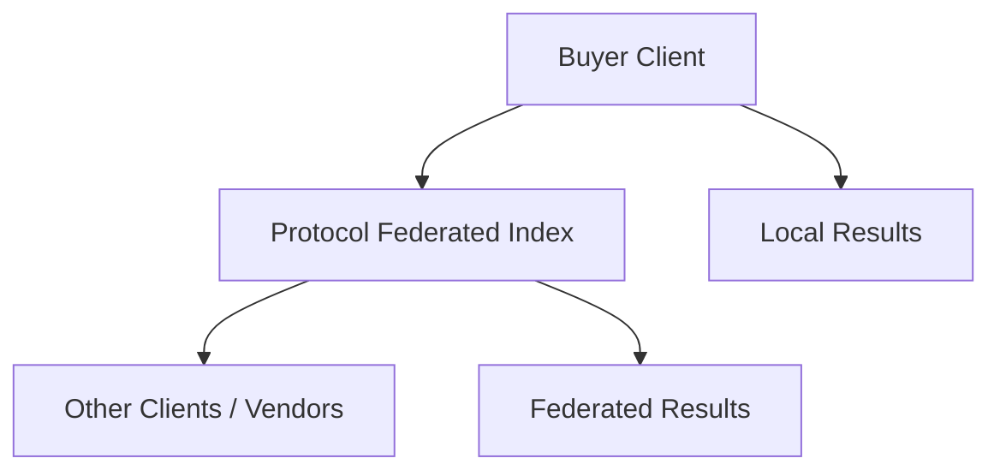

# Decentralised Protocol Marketplace  
**White Paper (Draft)**

---

## 1. Executive Summary
Globalising small businesses is hard. Most platforms are built for scale and capital, not for small operators. Alibaba grew through massive funding and deep vendor integration, Amazon remains primarily B2C-focused, and Etsy’s niche structure limits its global reach.

Meanwhile, economic policies and logistics systems disproportionately benefit large corporations, leaving small vendors trapped in local markets with limited access to cross-border commerce.

Rangkai is a client marketplace built on a lightweight, open protocol designed to:  
- Lower barriers to global trade for small businesses  
- Decentralise logistics, payments, and reputation  
- Remain tokenless and open-source from the start  
- Grow organically without depending on a large team or large funding  

The protocol is the brain. The client marketplace is the face, delivering local experiences, compliance, and onboarding. For now, both protocol and client are called Rangkai. Rangkai-client is the pilot client. Builders can build their own clients.

---

## 2. Context and Problem Space
Large platforms centralise everything but keep control. Small vendors become dependent rather than empowered.  

**Why small businesses struggle to scale globally:**  
- Payments are costly, slow, and inconsistent  
- Digital adoption is uneven  
- Logistics and export processes are fragmented  
- Trust and compliance vary wildly  

Large businesses export what is efficient, not what is unique. Global trade relies on small businesses to fill these gaps, but many fall out because there is no simple way to sell. They don’t have the manpower to handle marketing, logistics, and international sales on top of running their business.

### Marketplace Comparison

- Alibaba (China): Global B2B wholesale platform, export-focused, scaled through heavy funding and deep vendor integration.
- Amazon (USA): Retail and consumer goods platform, B2C with limited B2B, strong logistics but limited flexibility for small exporters.
- Etsy (USA): Niche global B2C marketplace for handmade and creative products, lacks cross-border scaling infrastructure.
- Handshake (Shopify, USA): Wholesale B2B platform integrated with Shopify, domestic + limited export, vendors remain locked into its ecosystem.

**Today’s marketplaces** are centralised, controlled, and optimised for volume over diversity. Millions of small producers remain invisible beyond their borders. A decentralised protocol enables global commerce without a single owner, letting small vendors trade on their own terms.

**Gaps to solve:**  
- Logistics  
- Payments  
- Trust  
- Flexible governance and compliance  

---

## 3. Protocol Philosophy
- Protocol-first, platform-optional  
- Tokenless utility, Bitcoin + Fiat  
- Portability and modularity; vendors and clients can move freely  
- People-first, not platform-first; focus on sellers and buyers  

---

## 4. Core Design Principles
- Portability of identity and reputation across marketplaces  
- Payment optionality (Bitcoin and fiat)  
- Decentralised logistics pooling rather than platform-managed shipping  
- Governance guardrails, not chaos; rough consensus and multisig approach  

---

## 5. Protocol Technical Architecture (Layer Model)

| Layer | Purpose | Core Features |
|-------|--------|---------------|
| 0 | Identity & Reputation | Portable identity (KYC/pseudonymous), signed reputation signals |
| 1 | Discovery & Catalog | Standard product schema, mobile-first listing, federated search |
| 2 | Transaction & Settlement | Escrow-first flow, Lightning + fiat options, client-defined fees |
| 3 | Logistics | Open courier registry, vendor-selected couriers, delivery triggers |
| 4 | Trust & Compliance | Ratings, disputes, sanctions advisory, tax tagging |
| 5 | Developer Layer | SDKs, APIs, Shopify/WooCommerce integration |
| 6 | Governance | Operator-led, gradual decentralisation |

*Note: Protocol remains neutral and non-custodial. Compliance, licensing, and payments remain at the client layer.*

---

## 6. User Journey Research
**Sellers:** Local, mobile-first, low digital literacy. Pain points: cross-border discovery, payments, compliance. Desired state: global reach with minimal onboarding friction.  

**Buyers:** Used to large marketplaces. Trust drivers: price, quality, reliable delivery. Expect multiple payment methods (escrow, NET30, card).  

**Logistics Providers:** Underserved but critical. Can bid directly to vendors. Operate on standard freight models.  

---

## 7. Regulatory Framework
| Responsibility | Protocol | Client Marketplace |
|----------------|---------|------------------|
| KYC & payment licensing | Neutral | Must comply with local laws |
| Export & sanctions | Advisory | Implementation & blocking |
| Tax | Optional modules | Full responsibility |
| Data privacy | Minimal storage | Jurisdiction-specific compliance |

*Note: Protocol advises but never enforces sanctions. Legal responsibility sits at the client layer.*

---

## 8. Ecosystem Strategy
- SDKs and plugins for Shopify, WooCommerce, and similar platforms  
- Interoperability with payment gateways, logistics APIs, and local associations  
- Designed to plug into, not compete with, existing platforms  
- Open-source approach; protocol funding only for maintenance and governance  

---

## 9. Roadmap
| Phase | Focus | Key Deliverables |
|-------|------|-----------------|
| 0 | Research & Schema | Flows, schema, escrow logic, vendor validation |
| 1 | MVP | Core protocol (Layers 0–3), Stripe + BTC, pilot corridor |
| 2 | Trust & SDKs | Add Layer 4, SDK/plugins, expand logistics pool |
| 3 | Ecosystem & Governance | Open connectors, progressive governance, token only if needed |

---

## 10. Governance Model (Progressive)

**Progressive Governance:**  
- **Operator-led (Early):** Operators manage disputes and maintain stability  
- **Hybrid:** Clients gain autonomy for local decisions  
- **Community:** Gradual ecosystem-level oversight once stable  

**Conflict Resolution:**  
- **Vendor vs Logistics:** Escrow + evidence-based mediation  
- **Fraud:** Freeze funds + investigation  
- **Client Misuse:** Escalation to operator or governance body  

*Governance stages guide how conflicts are resolved. Early disputes are operator-led but later ones increasingly delegated to clients or the community.*

---

## 11. Risk and Mitigation Table

| Risk | Type | Mitigation |
|------|------|-----------|
| Regulatory (KYC, crypto) | Legal | Client handles compliance, protocol remains neutral |
| Fraud | Operational | Escrow, dispute flows |
| Adoption | Market | Start narrow (vertical + corridor), vendor referral loop |
| Complexity | Build | Keep protocol thin, offload heavy features |
| Governance drift | Strategic | Gradual decentralisation with safeguards |

---

## 12. Non-Custodial Bitcoin Payments

- Works with both KYC and non-KYC marketplaces  
- Protocol stays neutral with no money transmission or fiat custody  
- Client marketplace is responsible for legal compliance  

**Payment Modes:**

| Feature | BTCPay | Native BTC/Lightning | Escrow Timeout |
|---------|--------|-------------------|----------------|
| Custody | None | None | None |
| Complexity | Higher | Low | Medium |
| Flexibility | High | Protocol primitive | Optional protection |

---

## 13. Dispute Responsibility Flow

Buyer pays → Escrow holds → Vendor ships → Delivery confirmed
      ↓                              ↓
No dispute                 Dispute window opens


- Evidence-based resolution: shipping proof, tracking, receipt  
- Clear responsibility allocation (Vendor / Courier / Buyer)  
- Optional insurance and arbitration layers  
- Ratings feed back into logistics trust signals  

---

## 14. Tooling Recommendations (MVP)

| Function | Tool | Notes |
|---------|------|------|
| Messaging | Nostr (anon), Twilio (KYC) | Lightweight dual-channel |
| Storage | Supabase | Cheapest for early stage |
| Database | Supabase Postgres | Minimal ops |
| Notifications | Resend, SendGrid | Simple setup |
| KYC | Manual → Onfido/Jumio later | Incremental scaling |
| Helpdesk | AI + Intercom | Fast vendor onboarding |
| Translation | Optional plugin | Client-controlled, protocol-neutral |

---

## 15. Federated Search: How It Works

**Protocol Perspective:**  
- Maintains federated indexes from all connected clients  
- Search API supports keywords, filters, geolocation  
- Neutral: does not host products or handle payments  

**Client Perspective:**  
- Sends search requests to protocol API  
- Receives results from multiple marketplaces  
- Applies localisation rules (currency, language, tax/VAT)  
- Can select which federated marketplaces to query  

**Vendor & Buyer Perspective:**  
- Vendor: Adds product; metadata indexed  
- Buyer: Searches locally; federated search finds global matches  

**Example Flow:**  
1. Buyer in Argentina searches “Cusco artisan chocolate”  
2. Local client has no results → query sent to protocol  
3. Protocol returns Peruvian vendor listing  
4. Buyer selects item → pays via Lightning invoice  
5. Escrow locks payment → vendor ships via approved courier  
6. Delivery confirmed → escrow releases payment  
7. Optional dispute resolution  

**Federated Search Diagram (Mermaid):**




## 16. Protocol Architecture (Lightweight Protocol)

| Layer | Function |
|-------|---------|
| 6     | Governance |
| 5     | SDK & Plugins |
| 4     | Trust & Compliance |
| 3     | Logistics |
| 2     | Transaction & Settlement |
| 1     | Discovery & Catalog |
| 0     | Identity & Reputation |

Neutral core

Federated structure

Legal responsibility at client level

Global reach without giant platforms

---

## 17. Client Architecture (High Level)

```text
┌──────────────────────────────────────────┐
│               RANGKAI CLIENT             │
│                                          │
│ ┌──────────────────────────────────────┐ │
│ │           USER INTERFACES             │ │
│ │ Vendor Dashboard | Buyer Marketplace | Admin │
│ └──────────────────────────────────────┘ │
│                                          │
│ ┌──────────────────────────────────────┐ │
│ │       BUSINESS LOGIC LAYER            │ │
│ │ - Auth, vendor onboarding             │ │
│ │ - Product management & order tracking │ │
│ │ - Payment & messaging                 │ │
│ │ - Malaysia-specific features          │ │
│ └──────────────────────────────────────┘ │
│                                          │
│ ┌──────────────────────────────────────┐ │
│ │       PROTOCOL SDK INTEGRATION        │ │
│ │ - Call protocol APIs                   │ │
│ │ - Subscribe to events                  │ │
│ │ - Handle federated search, escrow events │
│ └──────────────────────────────────────┘ │
└────────────────────┬────────────────────┘
                     ↓
              [ Rangkai Protocol Core ]
```

Each client can localise UI, payments, and compliance

Multiple clients can plug into the same protocol

Protocol upgrades remain backward compatible

---

## 18. Reputation Management

A decentralized reputation system ensures trust across multiple marketplaces. Vendors’ reputations follow them, allowing new clients to verify their reliability without starting from scratch.

**Reputation Calculation:** Scores are computed from completed transactions, ratings, dispute outcomes, delivery performance, and verification status (KYC, Nostr, or Anonymous).

*Figure: Flow of reputation proof creation and verification across marketplaces.*

sequenceDiagram
    participant V as Vendor
    participant RC as Rangkai Client
    participant P as Protocol Core
    participant CB as Client B

    V->>RC: Complete transaction
    RC->>P: Update reputation
    P->>P: Recalculate score & generate signed proof
    P-->>RC: Return ReputationProof

    V->>CB: Share ReputationProof
    CB->>P: Verify proof signature & validity
    P-->>CB: Proof valid
    CB->>V: Reputation imported

**Portability & Verification:** Signed reputation proofs allow vendors to carry their trust scores to other clients. Any client can verify the signature and timestamp to ensure authenticity.

**Security Considerations:** To prevent Sybil attacks, proofs are time-stamped, signed by the protocol, and tied to unique DIDs. Optional historical transaction hashes can provide additional auditability.

---


